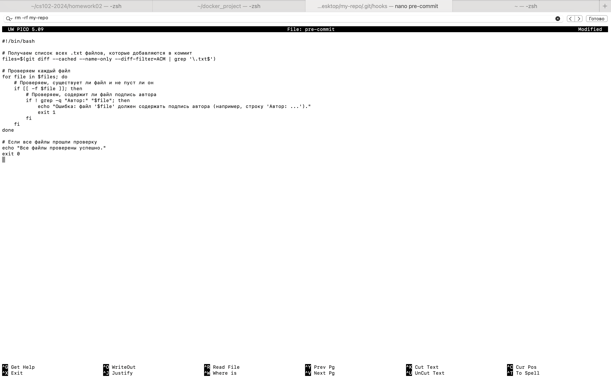
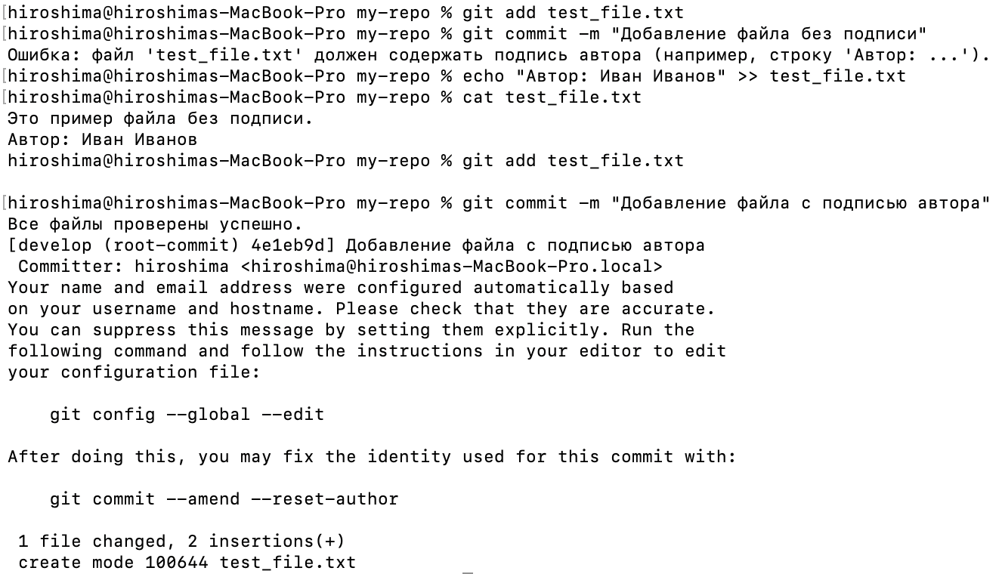
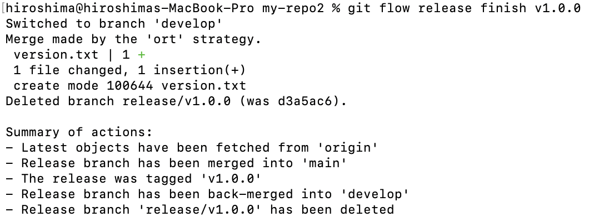
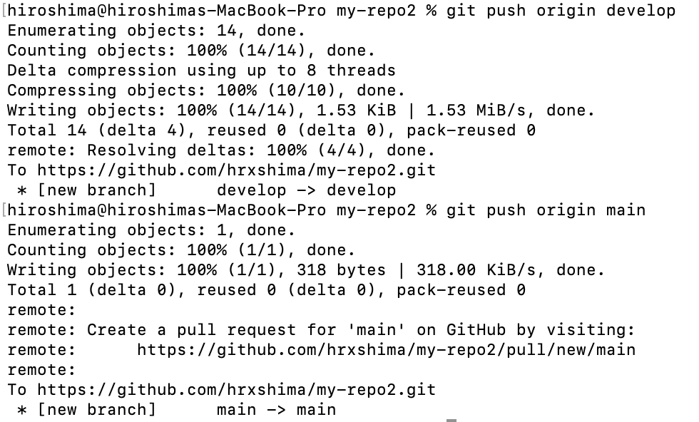

# Лабораторная работа №5 Пластинина Мария К3161

# Задание 1
1) Я создала файл pre-commit в /Desktop/gitproject/.git/hooks

2) Написала скрипт

3) Проверка:

# Задание 2
1) Установила Git Flow на локальной машине и инициализировала Git Flow в репозитории

2) Создала ветку feature/task-management, внесла изменения (функционал управления задачами), и завершила ветку

3) Подготовила релиз v1.0.0: обновила версию в файле, завершила релиз слиянием веток develop и main

4) Создала ветку hotfix, внесла исправления, завершила hotfix и объединила изменения с основными ветками.

5) Отправила все изменения в удаленный репозиторий.

